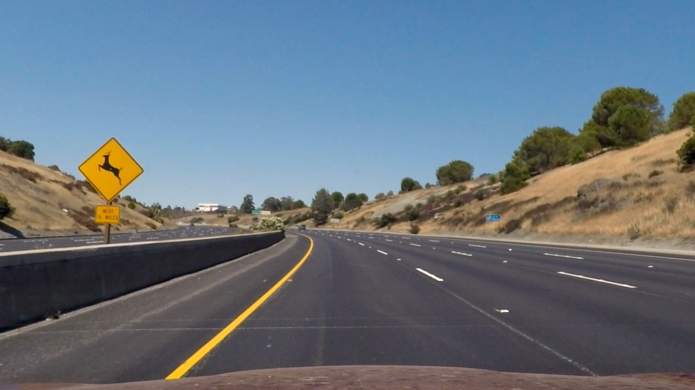

---

**Advanced Lane Finding Project**

The goals / steps of this project are the following:

* Compute the camera calibration matrix and distortion coefficients given a set of chessboard images.
* Apply a distortion correction to raw images.
* Use color transforms, gradients, etc., to create a thresholded binary image.
* Apply a perspective transform to rectify binary image ("birds-eye view").
* Detect lane pixels and fit a polynomial to them to find the lane boundary.
* Determine the curvature of the lane and vehicle position with respect to center.
* Warp the detected lane boundaries back onto the original image.
* Output visual display of the lane boundaries and numerical estimation of lane curvature and vehicle position.

[//]: # (Image References)

[image1]: ./examples/undistort_output.png "Undistorted"
[image2]: ./test_images/test1.jpg "Road Transformed"
[image3]: ./examples/binary_combo_example.jpg "Binary Example"
[image4]: ./examples/warped_straight_lines.jpg "Warp Example"
[image5]: ./examples/color_fit_lines.jpg "Fit Visual"
[image6]: ./examples/example_output.jpg "Output"
[video1]: ./project_video.mp4 "Video"

## [Rubric](https://review.udacity.com/#!/rubrics/571/view) Points

### Here I will consider the rubric points individually and describe how I addressed each point in my implementation.  

---

### Writeup / README

#### 1. Provide a Writeup / README that includes all the rubric points and how you addressed each one.  You can submit your writeup as markdown or pdf.  [Here](https://github.com/udacity/CarND-Advanced-Lane-Lines/blob/master/writeup_template.md) is a template writeup for this project you can use as a guide and a starting point.  

The follow is a write up of Project 3. Additionally, a README file is located in the main part of this repository.

### Camera Calibration

#### 1. Briefly state how you computed the camera matrix and distortion coefficients. Provide an example of a distortion corrected calibration image.

The code for this step is contained in the second code cell under the title "Camera Calibration Using Chessboard Images" of the IPython notebook located in "advanced_lane_finding.ipynb" (or in lines # through # of the file called `advanced_lane_finding.py`). This code was provided in Udacity Self-Driving Car, Term1, Lesson 15. 

"object points" were prepared, which were the (x, y, z) coordinates of the chessboard corners. It is assumed that the chessboard was fixed on the (x, y) plane at z=0, such that the object points were the same for each calibration image.  Thus, `objp` was just a replicated array of coordinates, and `objpoints` was appended with a copy of it every successful detection chessboard corners in a test image.  `imgpoints` was appended with the (x, y) pixel position of each of the corners in the image plane with each successful chessboard detection.  

The output `objpoints` and `imgpoints` were used to compute the camera calibration and distortion coefficients using the `cv2.calibrateCamera()` function.  This distortion correction was applied to the test image using the `cv2.undistort()` function and obtained the result: 

#### Image 6: Distorted Chessboard Image

#### Image 7: Undistorted Chessboard

### Pipeline (single images)

#### 1. Provide an example of a distortion-corrected image.

Distortion correction was applied to Image 8 below, using the same distortion coefficients used the the chessboard images. The output is also shown below: 

####Image 8: Distorted Test Image 

#### 2. Describe how (and identify where in your code) you used color transforms, gradients or other methods to create a thresholded binary image.  Provide an example of a binary image result.

For lane line identification, images in four color spaces (RGB, YUV, HSV, and HLS) were tested to determined which was best in detecting lane lines using a gradient operator and thresholding. Of the four, HLS more consistantly yielded both left and right lane lines.

RGB test images were converted to HLS color-space. A trapazoid-shaped region-of-interest (ROI) was created to filter out additional background features and just show the road in front of the car. The size of the ROI was based on visual inpection of the test images. Code may be view in the function `region_of_interest()` under the section "Functions for Image Manipulation" in Advanded_lane_finding.ipynb.

Next, the gradient of the L-channel was performed using the Sobel operator in the X-direction. Then the absolute value of the image was calculated, the image was scaled to a values between 0 and 255, and the image was thresholded and multiplied to yield a "binary" image, with values of 0 and 255. The S-channel image was simply thresholded and multiplied by 255 to create another "binary" image (0 and 255). Code may be view in the function `get_binary()` under the section "Functions for Image Manipulation" in Advanded_lane_finding.ipynb.

Then both binary images were ORed together to create a single binary image yielding both left and right lanes( see `pipline()` in section "Lane Finding Pipeline").

![Image 10][image3]

#### 3. Describe how (and identify where in your code) you performed a perspective transform and provide an example of a transformed image.

A perspective transformation was performed on the binary image using the function `warp_img()` in section "Functions for Image Manipulation". The function takes in source points (src_pts) and destination points (dst_pts) to calculate a transormation matrix (M) using the function `cv2.getPerspectiveTransormation()`.  The matrix is then used with cv2.warpPerspective() to warp the binary image.

Originally, the ROI points were used for src_pts while the dst_pts were derived from src_pts values, however the transformation was not acceptable resulting in poor line fitting (see below). Therefore, the src_pts and dst_pts were determined through trial-and-error (Table 1). The Images 11 and 10 show a straight image and the lane lines after the perspective transformation. 

[Table 1: Source and Destination Points for Matrix Transformation]

| Source        | Destination   | 
|:-------------:|:-------------:| 
| 490, 510      | 340, 470      | 
| 790, 510      | 1180, 470     |
| 250, 670      | 375, 670      |
| 1030, 670     | 1180, 670     |

![Image 11: Image with Straight Lane Line][image4]

![Image 12: Perspective Transformation of Straight-Line Image][image5]

#### 4. Describe how (and identify where in your code) you identified lane-line pixels and fit their positions with a polynomial?

To determine the lane lines, the warped image was passed to the function `find_lane_lines()`, from section "Functions For Lane Detection and Marking". This function used the histogram method described in the lecture, then fit a second order polynomial to the lane lines. The values of the lines and polynomial coefficients were stored in a Line() Class (see section "Line() Class to Store and Handle Line Fitting and Curve Radius Calculations"). During the video processing pipeline, the three most recent values of the fit lines were stored and average of these used to draw the located lines. This was done to filter out jitter. 

#### 6. Provide an example image of your result plotted back down onto the road such that the lane area is identified clearly.

To visually mark the driving lane, the left and right fit lines were passed the  `fill_lane()` (section "Functions For Lane Detection and Marking") which used `cv2.polyfill()` and `cv2.addWeighted()` to color the lane.  The warped lane was transformed back into it's original perspective using `warp_img()` with the src_pts and dst_pts arguments swaped. 

![image 13: Image with colored Lane]

#### 5. Describe how (and identify where in your code) you calculated the radius of curvature of the lane and the position of the vehicle with respect to center.

The radius of the curve was calculated during the lane line polynomial fitting using Line class funtions `left_right_fit()` and `add_radius()`. A 3-point moving average was used to smooth radius calculations during video processing. 

`Radius of curve =( (1+(2Ay+B)2)3/2 ) / ∣2A∣`

---

### Pipeline (video)

#### 1. Provide a link to your final video output.  Your pipeline should perform reasonably well on the entire project video (wobbly lines are ok but no catastrophic failures that would cause the car to drive off the road!).

Here's a [link to my video result](./project_video.mp4)

---

### Discussion

#### 1. Briefly discuss any problems / issues you faced in your implementation of this project.  Where will your pipeline likely fail?  What could you do to make it more robust?

Here I'll talk about the approach I took, what techniques I used, what worked and why, where the pipeline might fail and how I might improve it if I were going to pursue this project further.  
